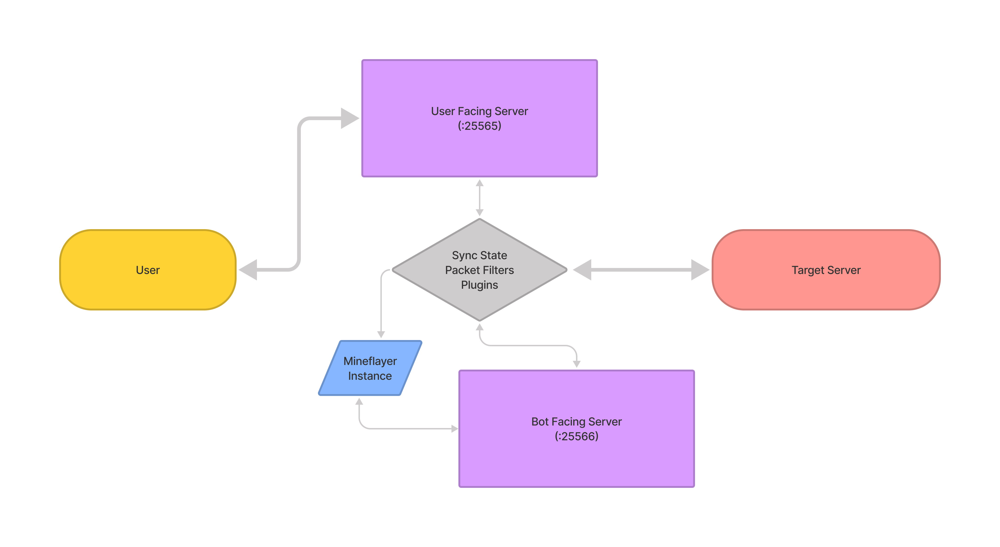

# Minecraft Reflection Proxy
Allows a Minecraft client and a mineflayer bot to control the same connection by mirroring the game state between clients.

## Design
The proxy maintains 2 server instances and a mineflayer bot, which the bot and player each connect to. World state and player data is synced between the bot and player and gameplay packets are filtered to the intended recipients.

## Plugin System
The current system loads plugins from ``./plugins/exports.js``.
For now plugins get initalized from exporting an ``init(targetServer, playerConnection, mineflayerBot, setPlayerControl)`` function and an array of commands to that the player can trigger.
The ``targetServer`` and ``playerConnection`` are [Client](https://node-minecraft-protocol.prismarine.js.org/#/API?id=mccreateclientoptions) instances, the ``mineflayerBot`` is a mineflayer [bot](https://mineflayer.prismarine.js.org/#/api?id=bot) instance.
``setPlayerControl(boolean: state)`` is called to set which game packets are forwareded to the server, ``true`` for the player and ``false`` for the bot.

## TODO
* Allow loading multiple world instances at a time, to allow to control multiple bots or different target server connections.
* Allow user client to leave and reconnect syncing state from bot state.
